### 平台信息

| 平台简称                           | 盼盼短剧 |
| ------------------------------------------ | ------------------------------------------------------------ |
| 平台全称 | 柏萱科技短剧SAAS管理平台 |
| 项目类型 | 微短剧 |
| 支持平台 | 微信小程序丨抖音小程序丨快手小程序丨H5 丨安卓APP |
| 开源模式 | uniApp前端个人开源，商用请联系客服 |
| 开发语言 | 主Vue.js，前端uniapp、后端JAVA |
| 活动通知 | 限时活动，超低折扣、欢迎咨询 |
| 当前版本 | V3.0 |
| 最后更新 | 2025.1.1 |
| 联系我们 | QQ群：977704805 |
| 企业微信 |  |
| 项目演示 | 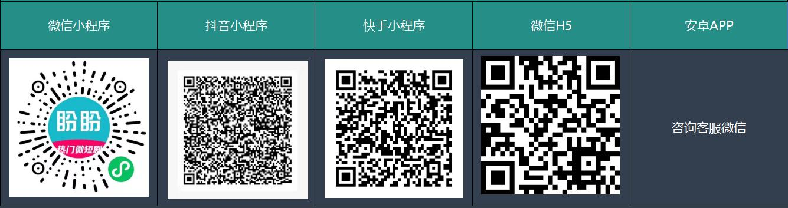 |

#### 1.项目介绍

##### 1.1技术框架介绍

盼盼短剧目前支持抖、微、快小程序、H5和安卓APP是基于SpringBoot、MybatisPlus、Vue2、Webpack、DCloud的前后端分离的微短剧项目。 项目分为Uniapp用户端（**兼容微信小程序**）和Vue后台管理端包括完整的权限管理系统， 基于以下技术栈开发：SpringBoot、MybatisPlus、Shiro、Quartz、jwt、websocket、Redis、Vue2、Uniapp、MySQL。

##### 1.2产品项目介绍

1.  盼盼短剧是一种基于JAVA后端和UNI-APP及安卓原生开发的移动互联网的应用程序，旨在提供工作闲暇之余观看微短剧视频应用服务
2.  主要核心功能为微短剧视频流及短剧剧集播放，我们集成了微信虚拟支付、微信支付、短剧播放器、媒资管理系统、分销管理系统
3.  实现了用户进入小程序后观看剧集、充值、消费解锁剧集等完整的业务流程线
4.  该开源版本为基础版本，非标准版，获取全部功能请联系客服

#### 2.软件演示体验

##### 2.0盼盼短剧系统介绍
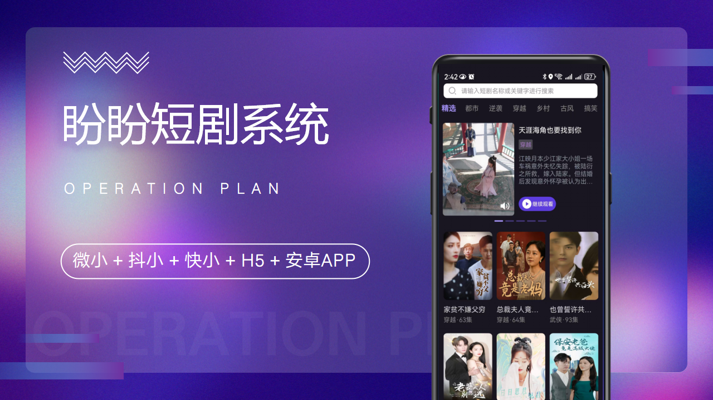
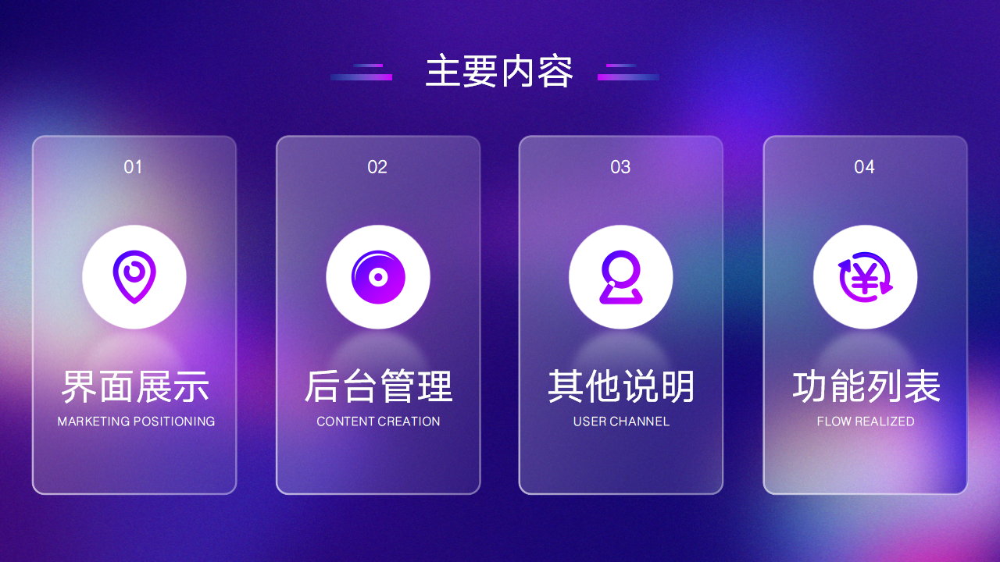

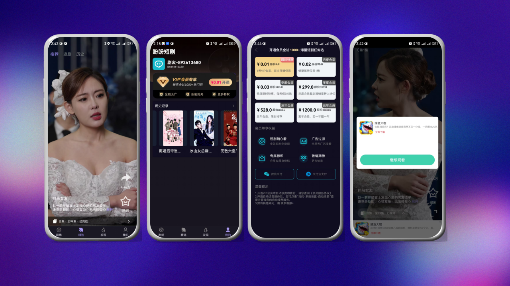

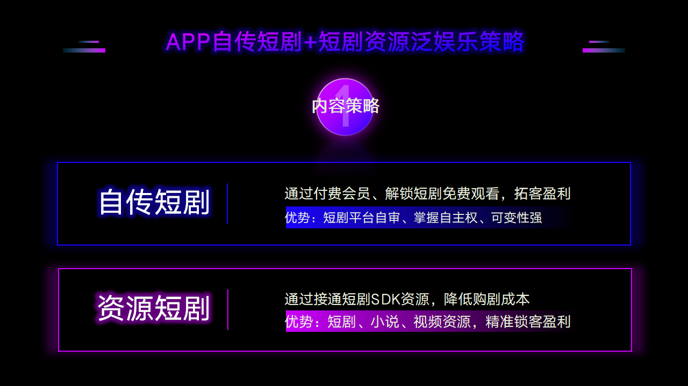
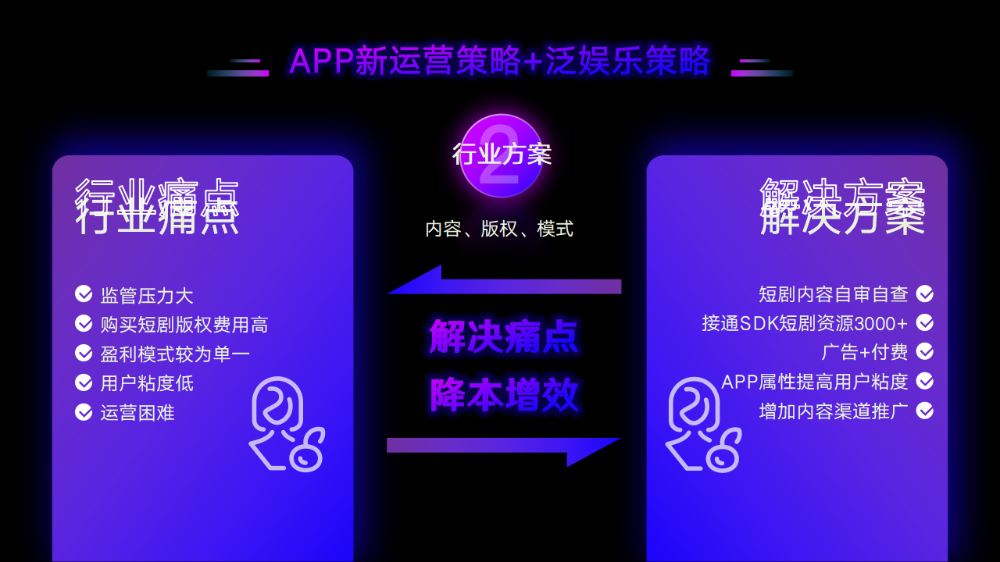
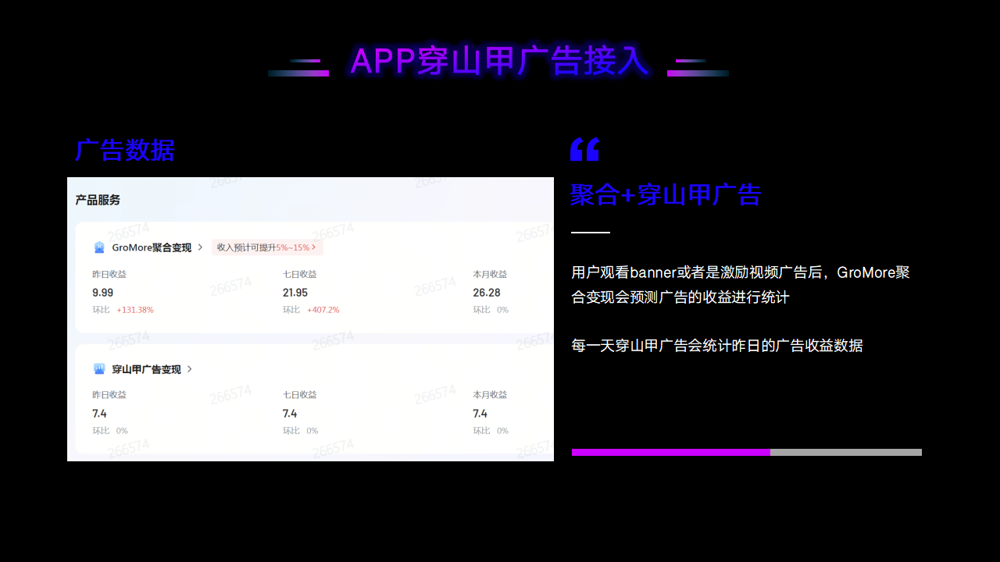

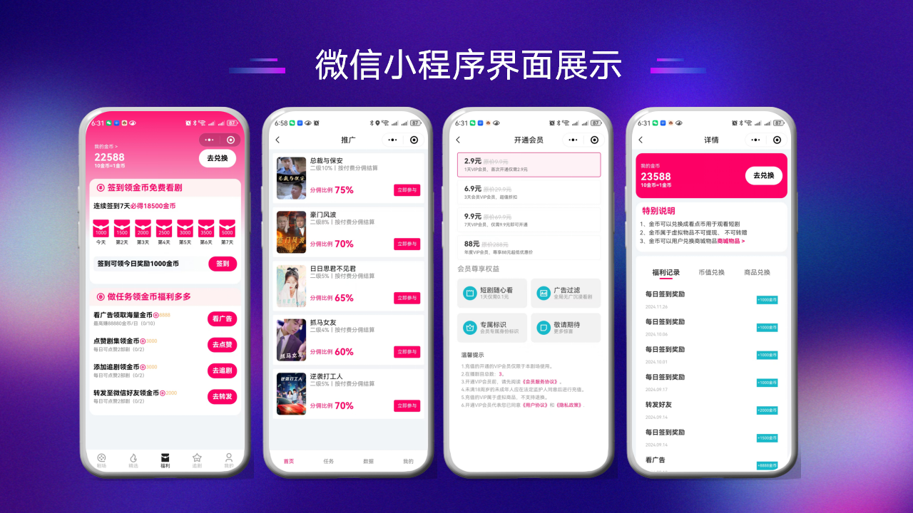

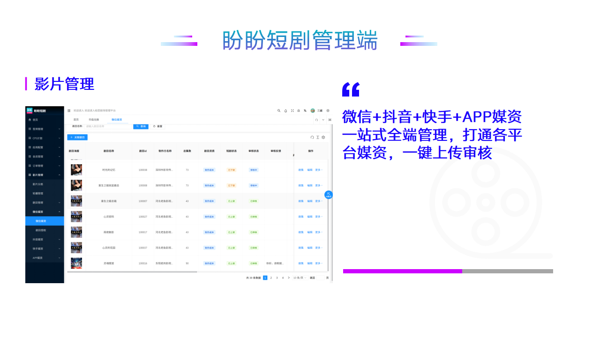
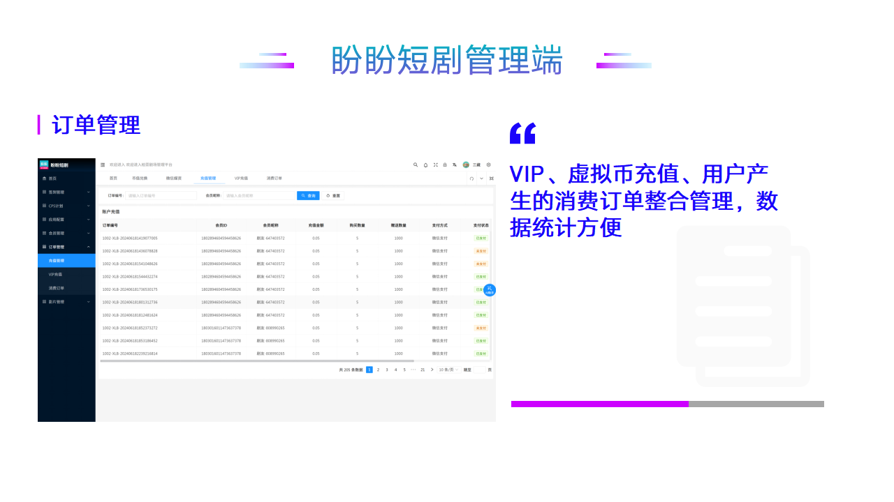
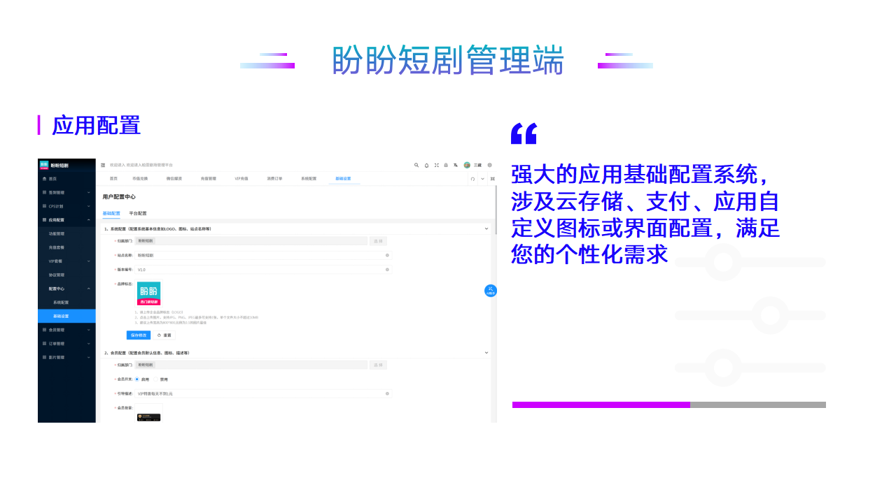

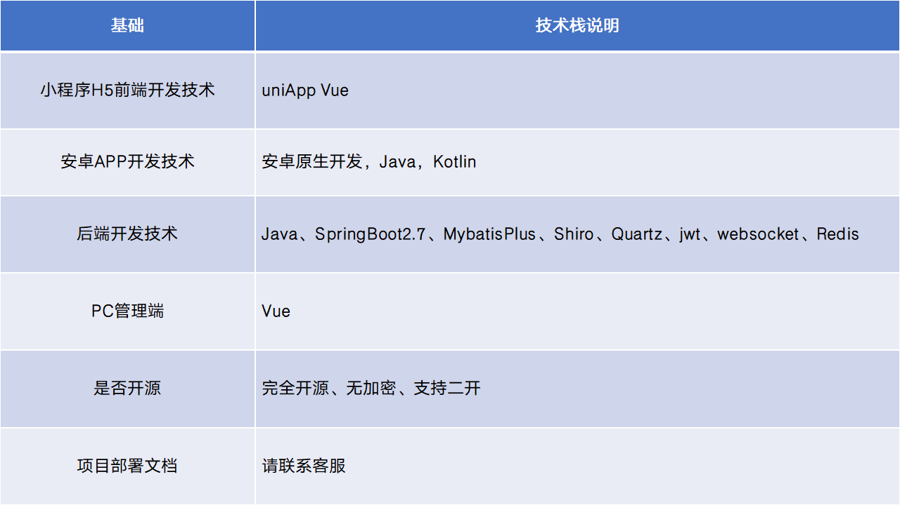
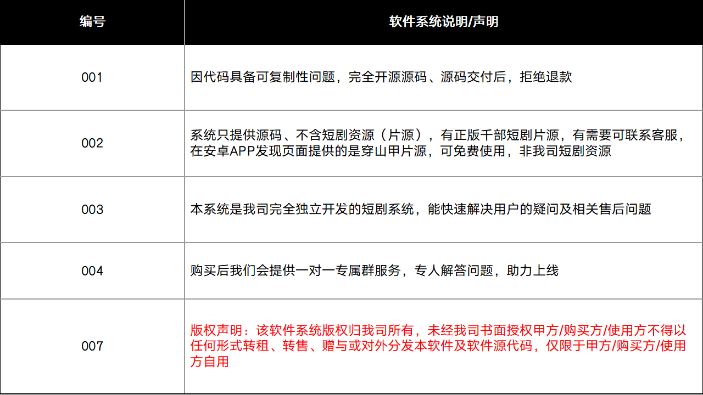
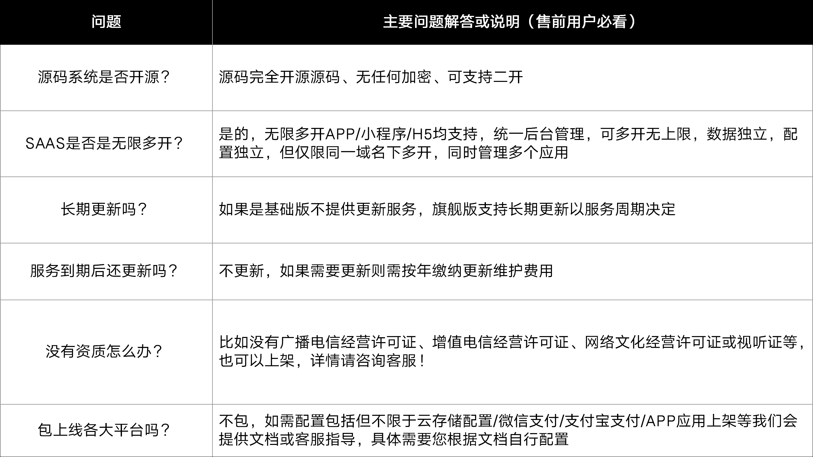
##### 2.1小程序以及后台管理演示

| 柏萱科技官网                           | [柏萱科技官网](http://www.baixuu.com/#/homes) |
| ------------------------------------------ | ------------------------------------------------------------ |
| H5开源地址：   | [小程序开源地址](https://gitee.com/baixuu/bai-xuans-short-play) |
| 微信小程序开源地址：   | [微信小程序开源地址](https://gitee.com/baixuu/vignette-video) |
| 完整版体验   | PC管理端、抖音、快手小程序安卓app完整版全功能体验请联系客服 |
| 客服企业微信 |  |
| 盼盼短剧-微信小程序，扫码可直接查看项目上线预览效果 |  |
| 迅捷剧场-微信小程序，扫码可直接查看项目上线预览效果 |  |
| 盼盼短剧项目交流QQ群号获取详细资料:977704805 |  |
| 柏萱剧场-公众号 |  |
| 柏萱奇迹-公众号 |  |

##### 2.2微信小程序功能介绍效果图

| 柏萱官网                           | [点击跳转官网](http://www.baixuu.com/#/homes) |
| ------------------------------------------ | ------------------------------------------------------------ |
| 【剧场】：在剧目列表中显示具体的剧目名称、播放数量以及剧目类型和剧集总数，明确告知用户详细信息、可按照对应分类查询           |                 |
| 【精选】：视频流展示并播放短剧第一集数据   |                 |
| 【福利】：用户签到，看广告领金币做任务，积分商城兑换    |                 |
| 【追剧】：记录用户在追短剧信息以及历史记录        |                 |
| 【我的】：主要功能为用户基本信息、VIP会员、账户充值、历史记录和分销系统    |   |
| 【分销管理-分销任务】：分销任务列表查询     |  |
| 【分销管理-我的任务】：在分销任务点击参与任务后添加至我的任务     |  |
| 【分销管理-任务详情】：任务详情基本信息，支持分享给微信好友     |  |
| 【分销管理-分销数据】：分销数据查询，包含团队记录、分成记录、提现记录查询     |  |
| 【分销管理-分销主页】：分销主页可设置相关的提现账户级查看团队记录、分成记录、提现记录     |  |
| 【分销管理-我的团队】：可查看我的一二级团队详情     |  |
| 【开通会员】：已对接虚拟支付和微信支付，但如果使用短剧播放器则只能使用虚拟支付，对应虚拟支付道具                          |                 |
| 【账户充值】：已对接虚拟支付和微信支付，但如果使用短剧播放器则只能使用虚拟支付，对应虚拟支付充值                          |                 |
| 【关于我们】：后台管理可以动态设置，主要上传相关协议及说明类文档                          |                 |
| 【协议详情】：富文本相关展示内容                          |                 |
| 【账户详情-充值记录】：主要功能为账户余额详情、充值记录                          |                 |
| 【账户详情-消费记录】：主要功能为账户余额详情、消费记录                          |                 |
| 【解锁剧集-充值弹窗】：用户滑动或主动点击到未解锁的剧集时，自动弹出充值弹窗，分为账号充值和开通VIP                          |                |
| 【剧目详情】：查询剧目详细信息                          |                 |
| 【剧目详情-演员信息】：查询演员信息详细信息                          |                |

##### 2.3柏萱科技短剧SAAS管理平台效果截图

| 官网                           | [官网](http://www.baixuu.com/#/homes) |
| ------------------------------------------ | ------------------------------------------------------------ |
| 【新增-签到系统】：支持配置签到设置、积分商城设置及提现等相关操作 |  |
| 【新增-抖音媒资】：支持上传同步、提交审核、剧集编辑、价格设置、视频管理 |  |
| 【新增-快手媒资】：支持上传同步、提交审核、剧集编辑、价格设置、视频管理 |  |
| 【改版-微信媒资】：支持上传同步、提交审核、剧集编辑、价格设置、视频管理 |  |
| 【系统配置-基础配置】：配置阿里云存储OSS基本参数，配置即用 |  |
| 【系统配置-平台配置】：配置小程序访问配置基本参数，配置即用 |  |
| 【系统配置-支付配置】：配置微信支付和虚拟支付基本参数，配置即用 |  |
| 【影片管理-视频管理】：上传管理视频，上传之后支持同步至媒资管理 |  |
| 【影片管理-剧目提审】：剧目提审新增之后支持将媒资管理中的剧目同步至管理平台，支持从平台提交至媒资管理审核 |  |
| 【剧目提审-剧集编辑】：剧目可编辑的信息为剧目基本信息、剧目设置、短剧详情设置 |  |
| 【剧目提审-剧集管理】：主要功能为替换审核剧集、设置剧集单价、播放、收藏、转发、点赞相关数据 |  |
| 【推广任务】：创建维护需要分销推广的剧目 |  |
| 【推广数据】：查看推广相关的业务数据 |  |
| 【推广记录】：查看用户的推广记录 |  |
| 【提现记录】：用户提现后可从后台给用户提现 |  |
| 【分成记录】：分销产生的分成记录 | |
| 【影片分类】：配置剧目分类 |  |
| 【协议管理】：配置协议相关资料信息 |  |
| 【功能管理】：配置功能管理列表相关功能 |  |
| 【订单管理-充值管理】：查询账户充值记录 |  |
| 【订单管理-VIP充值】：VIP充值记录查询 |  |
| 【订单管理-消费订单】：用户充值账户余额之后，看剧消费产生的消费的订单 |  |
| 【充值套餐】：配置账户充值基本参数，支持设置金额，充值比例由虚拟支付处配置 |  |
| 【会员管理】：查询会员基本详细信息，如账户余额，消费相关数据 |  |
| 【VIP套餐-权益设置】：配置VIP用户可以获得的相关权益 |  |
| 【VIP套餐-套餐管理】：配置道具列表参数，配置后支持推送至虚拟支付道具管理 |  |

#### 3.安装教程 

1.  如果是自己的小程序，或安卓APP则需要配置基础信息后才可以运行
2.  可以使用我们的小程序配置进行演示
3.  操作手册及相关文档说明请加群获取

**开源版文档**：盼盼短剧项目交流QQ群号获取详细资料:977704805,请加群后领取

| 官网                           | [官网](http://www.baixuu.com/#/homes) |
| ------------------------------------------ | ------------------------------------------------------------ |
| 盼盼短剧项目交流QQ群号获取详细资料:977704805 |  |

#### 4.必看说明

1.  前端微信小程序需要配置基本参数后才可以运行
2.  如果是自己的小程序需要运行后播放视频，需要具备微短剧类目，已审核通过的剧目信息才可以
3.  操作手册及相关文档说明请加群获取
4.  微信小程序版本是早期的版本，不是最新的，且要运行项目需要授权，请联系客服
5.  H5版本属于早期版本不包含分销等相关功能，下载后直接运行即可，均只是前端开源
6.  安卓APP配置项较多，详情请联系客服

#### 5.开源须知

- 开源版uniApp源码仅允许用于个人学习研究使用.

- 禁止将本开源的代码和资源进行任何形式任何名义的改造或出售.

- 本产品已申请软件著作权，限制商用，如果需要商业使用请联系我们，添加企业客服微信或者加入QQ群，商用可提供uniApp源码、后台管理端源码、后台源码或者是其他产品服务类型皆可

| 商用请联系客服企业微信                           |  |
| ------------------------------------------ | ------------------------------------------------------------ |
| 盼盼短剧项目交流QQ群号获取详细资料:977704805 |  |

#### 6.标准版更新记录

###### **V3.0安卓APP发布**

<u>2025.1.1</u>

1.【新增】剧集自动播放

2.【新增】自研短剧播放器

3.【新增】接入广告平台穿山甲、优量汇、快手、百度

4.【新增】微信、支付宝支付以及提现到账功能

5.【新增】VIP充值、解锁剧集、去广告

6.【新增】签到功能

7.【新增】分享至朋友圈微信功能

###### **V2.1发布**

<u>2024.11.11</u>

1.【新增】新增微信扫码绑定分销功能

2.【优化】播放业务逻辑

3.【优化】快手tabbar界面更新

4.【新增】快手小程序已上架

###### **V2.0发布**

<u>2024.09.14</u>

1.【新增】微信、快手支持签到功能

2.【新增】抖音媒资系统、快手媒资系统

3.【新增】抖音新增CPS分销管理功能、分销任务、数据、主页、推广相关功能

4.【新增】快手新增CPS分销管理功能、分销任务、数据、主页、推广相关功能

5.【新增】抖音：抖音支付、微信支付、支付宝支付

6.【新增】快手：微信支付、支付宝支付

7.【优化】微信UI界面优化

###### **V1.2.3发布**

<u>2024.07.31</u>

1.【抖音小程序】支持运行至抖音小程序，优化视频组件播放功能

2.【微信小程序】新增分销管理功能、分销任务、数据、主页、推广相关功能

3.【PC管理端】新增CPS分销管理功能、分销任务、数据、主页、推广相关功能

###### **V1.2.2发布**

<u>2024.07.25</u>

1.【H5】更新支持微信支付

2.【H5】剧集解锁优化

3.【H5】视频播放优化

4.【微信小程序】首页新增轮播图功能

5.【微信小程序】界面UI优化

###### **V1.2.1发布**

<u>2024.07.17</u>

1.【H5】更新根据设备ID自动注册用户去掉原来用户需要输入账号才能登录的功能

2.【H5】剧场底部样式调整

3.【H5】播放剧集优化

4.【更新】短剧支持H5浏览器

5.【更新】自研短剧播放器更新

<u>2024.07.02</u>

###### **V1.1.10发布**

1.【新增】账户充值、开通VIP以及充值弹窗仅在安卓平台显示

2.【说明】微信IOS平台用户不支持虚拟支付，即相关功能也不能对该用户显示，否则将会被封禁搜索以及禁止IOS用户进入小程序

3.【更新】配置项说明

<u>2024.06.26</u>

###### **V1.1.9发布**

1.修复了精选页面无法暂停的问题

<u>2024.06.23</u>

###### **V1.1.8发布**

1.优化历史记录信息

2.优化底部tab栏显示问题

3.整合历史资源，记录发布资源

4.新增《用户协议》、《隐私协议》、《会员服务协议》

5.新增异常反馈及联系客服入口

<u>2024.06.15</u>

###### **V1.1.7发布**

1.发布SAAS化后第二个产品迅捷剧场，审核中

2.优化我的页面UI设计

3.解决历史数据加载不及时问题

<u>2024.06.10</u>

###### **V1.1.6发布**

1.解决在用户开通VIP是需要提示本剧场的所有剧目总数

2.优化用户在进入剧场时，拿不到缓存数据的异常问题

3.系统优化加载过慢，导致黑屏等相关问题

<u>2024.06.1</u>

###### **V1.1.5发布**

1.新增账户详情，可查询历史交易记录，以及充值记录

2.盼盼短剧正式发布

3.对接媒资管理系统

<u>2024.05.27</u>

###### **V1.1.4发布**

1.新增用户购买剧集逻辑

2.新增用户开通VIP后免费观看剧集逻辑

3.系统优化加载过慢

<u>2024.05.22</u>

###### **V1.1.3发布**

1.对接调试虚拟支付，上传道具

2.对接调试虚拟支付，发布道具

3.解决虚拟支付无法付款问题

<u>2024.05.18</u>

###### **V1.1.2发布**

1.新增虚拟支付

2.新增用户开通VIP

2.新增用户账户充值功能

<u>2024.05.11</u>

###### **V1.1.1发布**

1.对接调试虚拟支付，上传道具

2.对接调试虚拟支付，发布道具

3.解决虚拟支付无法付款问题

<u>2024.04.28</u>

###### **V1.1.0发布**

1.前端对接短剧播放器插件

2.接通短剧播放器插件进入播放器界面进行播放，逻辑优化

3.获取剧目授权

4.接入充值弹窗

<u>2024.04.25</u>

###### **V1.0.7发布**

1.接通视频流插件功能

2.优化已知BUG

3.后台管理第一个版本上线

<u>2024.04.20</u>

###### **V1.0.6发布**

1.前端优化剧目列表UI设计界面

2.联调微信支付功能

3.解决微信支付回调错误BUG

<u>2024.04.11</u>

###### **V1.0.5发布**

1.前端优化整体UI设计界面

2.新增微信支付功能

<u>2024.03.22</u>

###### **V1.0.4发布**

1.新增VIP会员页面

2.新增账户充值页面

3.优化用户注册时重复注册BUG

4.解决剧场分类无法点击问题

5.解决分类渲染不及时拿不到缓存相关问题

<u>2024.02.20</u>

###### **V1.0.3发布**

1.新增追剧

2.新增追剧历史

3.新增追剧列表接口对接及渲染

<u>2023.11.23</u>

###### **V1.0.2发布**

1.新增剧场剧目列表渲染

2.新增剧场列表

3.新增剧场列表刷新逻辑

4.下拉刷新，触底刷新切换分类刷新

<u>2023.10.04</u>

###### **V1.0.1发布**

1.新增剧场

2.新增剧场分类调整

3.新增频道及分类筛选

4.V1.0.0全新升级发布，整合资源发布上线

<u>2023.06.04</u>

###### **V1.0.0发布**
